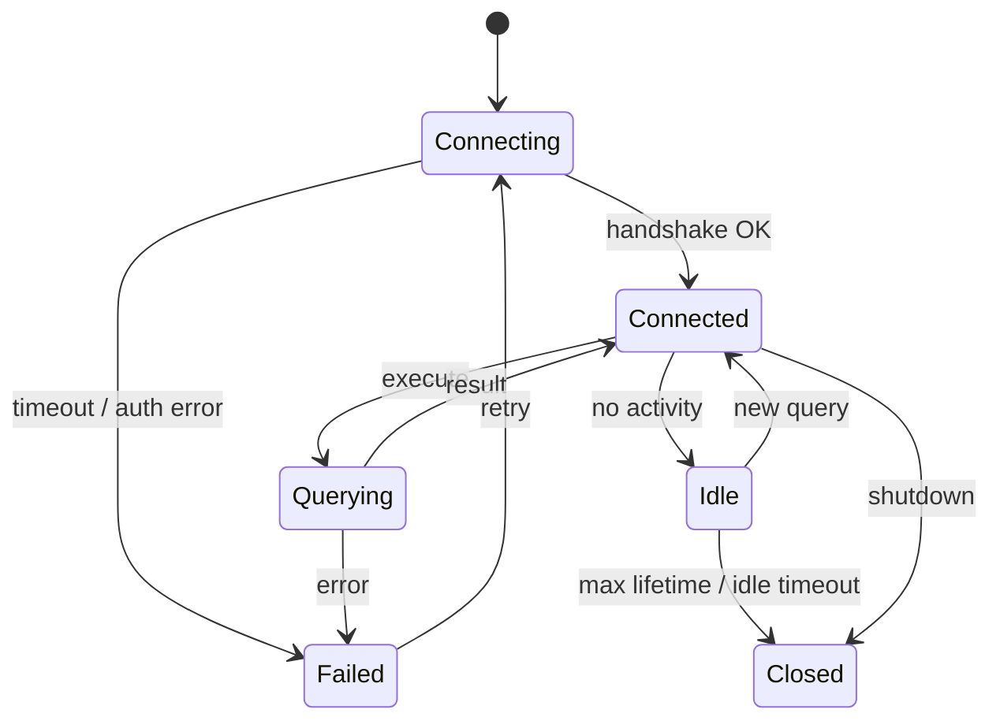

# Database Integration Review Checklist

Use this checklist when researching a database client, driver, integration, or proxy.

---

## Connection Lifecycle

- [ ] Connection creation — how is it opened? What protocol handshake?
- [ ] Connection pooling — max open, max idle, lifetime, idle timeout
- [ ] Reconnection strategy — automatic? Backoff? Detection of stale connections?
- [ ] Connection close / cleanup — graceful shutdown handling
- [ ] Context cancellation — does it propagate to in-flight queries?

## Authentication and TLS

- [ ] Authentication methods supported (password, IAM, certificate, LDAP)
- [ ] TLS/SSL — supported? Required? How configured?
- [ ] Certificate verification — skip-verify option? Custom CA?
- [ ] Credential rotation — does it handle credential changes without restart?

## Query Patterns

- [ ] Prepared statements — used? Cached? Connection-scoped or pool-scoped?
- [ ] Parameterized queries — SQL injection protection
- [ ] Batch operations — supported? How?
- [ ] Transaction handling — isolation levels, timeout, rollback on error

## Error Handling

- [ ] Error classification — transient vs permanent
- [ ] Retryable error detection — which errors trigger retry?
- [ ] Timeout handling — connection timeout, query timeout, read/write timeout
- [ ] Error wrapping — are original errors preserved for `errors.Is`/`errors.As`?

## Metrics and Health

- [ ] What metrics are collected (query count, latency, errors, pool stats)?
- [ ] Health check mechanism — ping? Canary query? Passive detection?
- [ ] Metric export format (Prometheus, StatsD, custom JSON)
- [ ] Connection pool observability (active, idle, waiting counts)

## Security

- [ ] Credential handling — how are passwords/tokens passed?
- [ ] Credential sanitization — are creds stripped from error messages and logs?
- [ ] DSN/connection string handling — logged anywhere?
- [ ] Audit logging — does the integration log queries?

## Schema and Compatibility

- [ ] Database version compatibility — what versions are supported?
- [ ] Schema assumptions — hardcoded table/column names?
- [ ] Migration handling — does it create/modify schema?
- [ ] Feature detection — does it check server capabilities?

## Docker / Testing

- [ ] Docker Compose setup for local development
- [ ] Test database initialization (schema, seed data)
- [ ] Test isolation — per-test databases? Transactions? Cleanup?
- [ ] Version matrix — tested against multiple database versions?
