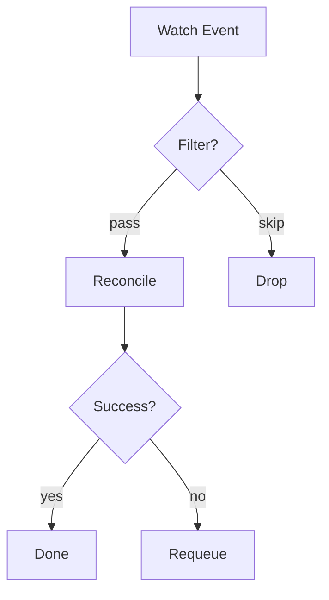

# Kubernetes Controller / Operator Review Checklist

Use this checklist when researching a Kubernetes controller, operator, or CRD-based system.

---

## CRD and API Design

- [ ] API group, version, and kind — is versioning intentional?
- [ ] Spec vs Status separation — is status a pure output?
- [ ] Defaulting and validation — webhook or in-code?
- [ ] Conversion webhooks for multi-version CRDs
- [ ] Printer columns (`+kubebuilder:printcolumn`) for `kubectl get` output
- [ ] Short names and categories

## Reconciliation Loop

- [ ] Idempotency — does re-reconciling the same object produce the same result?
- [ ] Requeue strategy — fixed interval, exponential backoff, event-driven?
- [ ] Error handling — what errors requeue vs get dropped?
- [ ] Predicate filters — does the controller skip irrelevant events?
- [ ] Multi-resource watching — secondary watches with owner mapping

## Ownership and Lifecycle

- [ ] OwnerReferences set on child resources (garbage collection)
- [ ] Finalizers — what cleanup happens on deletion?
- [ ] Adoption — does the controller adopt pre-existing resources?
- [ ] Status conditions — what conditions are reported? Standard format?
- [ ] Events — what Kubernetes events are emitted?

## RBAC and Security

- [ ] ClusterRole vs Role — is the scope minimal?
- [ ] Permissions inventory — list every resource/verb granted
- [ ] ServiceAccount configuration
- [ ] Network policies for controller pod
- [ ] Secrets access — how are credentials consumed?

## Deployment

- [ ] Helm chart or Kustomize — how is it deployed?
- [ ] Leader election — enabled? Configurable?
- [ ] Replica count and HA considerations
- [ ] Resource requests/limits set
- [ ] PodDisruptionBudget configured
- [ ] Health probes — readiness checks what? Liveness checks what?

## Testing

- [ ] envtest usage — controller tests against fake API server
- [ ] Fake client vs real client in tests
- [ ] Integration / e2e tests — kind cluster? Real cluster?
- [ ] Test coverage of error/requeue paths
- [ ] Test coverage of finalizer and deletion flows

## Observability

- [ ] controller-runtime metrics endpoint (`/metrics`)
- [ ] Custom metrics beyond defaults
- [ ] Reconcile duration and error rate tracking
- [ ] Structured logging with reconcile context (namespace/name)

## Framework

- [ ] kubebuilder version and scaffolding
- [ ] controller-runtime version
- [ ] client-go version compatibility with target K8s versions
- [ ] Code generation — `make generate` and `make manifests` up to date?
