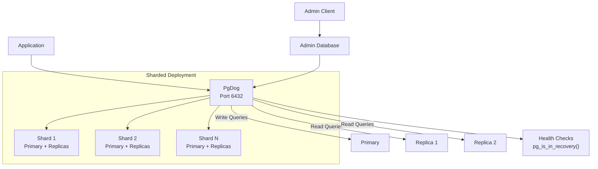

# PgDog — Architecture Analysis

PgDog is a Rust-based PostgreSQL proxy providing connection pooling, load balancing, query routing, read/write splitting, and database sharding in a single executable.

---

## Table of Contents

1. [Project Status](#1-project-status)
2. [Architecture](#2-architecture)
3. [Features](#3-features)
4. [Sharding](#4-sharding)
5. [Kubernetes Deployment](#5-kubernetes-deployment)
6. [Managed Service Compatibility](#6-managed-service-compatibility)
7. [Configuration](#7-configuration)
8. [Observability](#8-observability)
9. [Comparison to Other PG Proxies](#9-comparison-to-other-pg-proxies)
10. [Concerns and Limitations](#10-concerns-and-limitations)
11. [Reference Links](#11-reference-links)

---

## 1. Project Status

| Attribute | Value |
|---|---|
| Latest release | v0.1.37 — April 16, 2026 |
| Release cadence | Weekly (5 releases in last 4 weeks) |
| Stars | 4,283 |
| Forks | 171 |
| Contributors | 15 |
| Language | Rust |
| License | AGPL-3.0 |
| Last push | 2026-04-19 (actively maintained) |
| Description | "PostgreSQL connection pooler, load balancer and database sharder" |

**Pre-v1.0 status** — breaking changes are possible. Only the latest version receives security updates per their [security policy](https://github.com/pgdogdev/pgdog/security/policy).

---

## 2. Architecture



### Key Architectural Properties

- **Multi-threaded async** — built on Tokio runtime (async I/O with epoll/kqueue)
- **Direct PostgreSQL protocol implementation** — not a TCP proxy wrapper
- **SQL parser extracted from PostgreSQL source** — understands query semantics for routing
- **Stateless** — no persistent state between instances, horizontally scalable
- **Connection pools per user/database pair** — maintains per-client state in transaction mode

### Connection Multiplexing

PgDog supports two pooling modes:

- **Transaction mode** — connections returned to pool after each transaction. Handles `SET` statements and prepared statements per-client without application changes (improvement over PgBouncer).
- **Session mode** — connection held for entire client session.

Can theoretically handle hundreds of thousands of concurrent connections on commodity hardware.

---

## 3. Features

### Connection Pooling
Transaction and session modes with multi-threaded architecture. Creates connection pools for each user/database pair.

### Read/Write Splitting
SQL parsing detects reads vs writes. The PostgreSQL parser (extracted from PG source) routes queries to appropriate backends — writes to primary, reads distributed across replicas.

### Load Balancing
Three distribution strategies:
- Round robin
- Random
- Least active connections

### Failover & Health Checks
Real-time health monitoring using `pg_is_in_recovery()`. Automatic failover detection. PgDog detects failover but does not trigger it — complementary tools like Patroni or managed service failover are needed.

### Authentication
- SCRAM-SHA-256, MD5, plain text
- AWS RDS IAM token authentication (passwordless)
- Azure Workload Identity authentication

### Query Mirroring
Can mirror queries to secondary backends for testing.

---

## 4. Sharding

PgDog's sharding is a differentiating feature — most PostgreSQL proxies (PgBouncer, Odyssey) don't offer it.

### Sharding Strategies

- **Hash partitioning** — consistent hashing on sharding key
- **List partitioning** — explicit value-to-shard mapping
- **Range partitioning** — value ranges mapped to shards
- **Schema-based sharding**

### Automatic Query Routing

PgDog extracts sharding hints from SQL using the PostgreSQL parser and routes queries to the correct shard. Supports both automatic detection and manual routing via query comments or `SET` commands.

### Cross-Shard Queries

Queries without a sharding key are distributed to all shards with results collected and aggregated in-memory. Supports SELECT, INSERT, UPDATE, DELETE, DDL, and COPY operations.

### Two-Phase Commit

Atomic transactions across shards using PostgreSQL's prepared transactions (`PREPARE TRANSACTION` / `COMMIT PREPARED`).

### Online Resharding

Uses PostgreSQL logical replication to copy tables between databases while resharding in-flight. No downtime required.

### Primary Key Generation

Built-in BIGINT and UUID unique identifier generation without requiring distributed sequences.

---

## 5. Kubernetes Deployment

### Official Helm Chart

Repository: https://github.com/pgdogdev/helm (actively maintained — last push April 17, 2026)

```bash
helm repo add pgdogdev https://helm.pgdog.dev
helm install pgdog pgdogdev/pgdog
```

### K8s Features

- PodDisruptionBudgets for HA
- Pod anti-affinity rules for node distribution
- ExternalSecrets integration for credential management
- RBAC with minimal required permissions
- Prometheus sidecar support built-in
- Automatic config reloads with optional `restartOnConfigChange`
- 1GB-to-1CPU resource ratio recommendation

### Deployment Options

| Method | Description |
|---|---|
| K8s Helm | Official chart at `helm.pgdog.dev` |
| AWS ECS | Terraform module at `pgdogdev/pgdog-ecs-terraform` |
| Docker | Images at `ghcr.io/pgdogdev/pgdog:<version>` for every commit and tagged release |
| Docker Compose | Quick-start templates included in repo |
| Binary | Compile from source with Rust toolchain |

---

## 6. Managed Service Compatibility

### Aurora PostgreSQL / AWS RDS

- Works with Aurora PostgreSQL and standard RDS for PostgreSQL
- Supports AWS RDS IAM token authentication for passwordless connections
- Terraform module available for AWS ECS deployment
- No specific limitations documented — treats as standard PostgreSQL instances

### Azure Database for PostgreSQL

- Supports Azure Workload Identity authentication
- Standard PostgreSQL wire protocol compatibility

### General

PgDog speaks the PostgreSQL wire protocol and works transparently with any PostgreSQL-compatible backend without application code changes.

---

## 7. Configuration

### Configuration Files

Two files required:

**`pgdog.toml`** — general settings, hosts, sharding configuration, pools, plugins, admin settings

```toml
[general]
port = 6432
default_pool_size = 10

[[databases]]
name = "mydb"
host = "primary.example.com"
```

**`users.toml`** — user credentials and authentication methods

```toml
[[users]]
name = "app_user"
database = "mydb"
password = "secret"
```

### Hot Reload

Most settings can be reloaded without restart:
- `kill -HUP pgdog` (SIGHUP)
- `RELOAD` admin command
- Maintains active connections during reload
- Zero-downtime configuration updates

### Setting Priority

User settings > Database settings > General defaults

All time values use milliseconds.

---

## 8. Observability

### Metrics Access

Two methods:
1. **Admin database queries** — SQL interface for pool stats, query stats
2. **OpenMetrics HTTP endpoint** — Prometheus/Datadog compatible

### Metric Categories

| Category | Examples |
|---|---|
| Connection pools | Clients connected, servers in use, queue wait times |
| Transactions | Counts, timing, 2PC operations |
| Queries | Execution counts and timing |
| Cache | Prepared statement hits, query cache |
| Network | Bytes sent/received |
| Mirroring | Request tracking, queue status |

### Prometheus Integration

```toml
[general]
openmetrics_port = 9090
```

Disabled by default. Only configurable at startup (not hot-reloadable). 40+ metrics with second granularity.

---

## 9. Comparison to Other PG Proxies

| Feature | PgDog | PgBouncer | Pgpool-II | Citus |
|---|---|---|---|---|
| Architecture | Multi-threaded async (Tokio) | Single-threaded | Process-based | PG extension |
| Connection pooling | Transaction + session | Transaction + session + statement | Yes | N/A (extension) |
| Load balancing | Round robin, random, least active | No (requires external) | Yes | N/A |
| Read/write splitting | Built-in SQL parsing | No | Yes | N/A |
| Failover detection | `pg_is_in_recovery()` | No | Yes | N/A |
| Sharding | Hash, list, range, schema | No | No | Yes (coordinator) |
| Cross-shard queries | Yes (distributed) | N/A | N/A | Yes |
| 2PC | Yes | No | No | Yes |
| Prepared stmts in txn mode | Yes (per-client state) | Limited | Yes | Yes |
| Metrics | OpenMetrics + admin | Basic stats | Yes | PG stats |
| Language | Rust | C | C | C (PG extension) |

Source: [PgDog comparison page](https://docs.pgdog.dev/architecture/comparison) covers PgBouncer and PgCat. Pgpool-II and Citus comparisons from [pgdog.dev/blog](https://pgdog.dev/blog/pgdog-vs-citus).

**Note:** PgDog's comparison blog posts make qualitative claims (multi-threaded = more TPS) but do not publish benchmark numbers. Verify performance claims with your own workload.

---

## 10. Concerns and Limitations

> **Concern: Pre-v1.0 maturity.** Breaking changes possible. Only the latest version receives security patches. Evaluate carefully for production use.

> **Concern: AGPL-3.0 license.** Strong copyleft — if PgDog is modified and exposed as a service, source code must be shared. Enterprise features require a separate paid license.

> **Concern: Failover is detection-only.** PgDog detects when a primary becomes a replica but does not trigger failover. Requires Patroni, managed service failover, or another HA tool.

> **Concern: No published benchmarks.** Performance claims (multi-threaded, hundreds of thousands of connections) are architectural arguments, not measured results. Test with your workload.

> **Concern: Small contributor base.** 15 contributors and 171 forks. Compare to PgBouncer (mature, widely deployed) or ProxySQL (1,069 forks).

---

## 11. Reference Links

| Resource | URL |
|---|---|
| GitHub repo | https://github.com/pgdogdev/pgdog |
| Official website | https://pgdog.dev |
| Documentation | https://docs.pgdog.dev |
| Helm chart | https://github.com/pgdogdev/helm |
| Terraform (ECS) | https://github.com/pgdogdev/pgdog-ecs-terraform |
| Docker images | ghcr.io/pgdogdev/pgdog |
| vs PgBouncer blog | https://pgdog.dev/blog/pgdog-vs-pgbouncer |
| vs Citus blog | https://pgdog.dev/blog/pgdog-vs-citus |
| Architecture comparison | https://docs.pgdog.dev/architecture/comparison |
| Sharding docs | https://docs.pgdog.dev/features/sharding |
| Metrics docs | https://docs.pgdog.dev/features/metrics |
| Installation docs | https://docs.pgdog.dev/installation |
| Configuration docs | https://docs.pgdog.dev/configuration |
| Production readiness blog | https://pgdog.dev/blog/building-for-production |
| Wire protocol blog | https://pgdog.dev/blog/hacking-the-postgres-wire-protocol |
