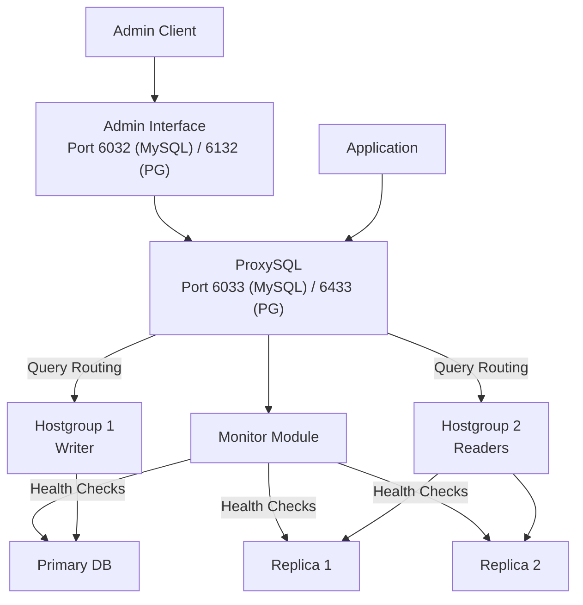
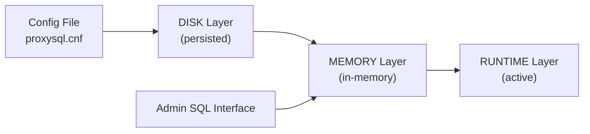

# ProxySQL — Architecture Analysis

ProxySQL is a high-performance, protocol-aware proxy for MySQL (and forks) and PostgreSQL, providing connection pooling, query routing, read/write splitting, failover, query caching, and an SQL-based admin interface.

---

## Table of Contents

1. [Project Status](#1-project-status)
2. [Architecture](#2-architecture)
3. [MySQL Support](#3-mysql-support)
4. [PostgreSQL Support](#4-postgresql-support)
5. [Kubernetes Deployment](#5-kubernetes-deployment)
6. [Managed Service Compatibility](#6-managed-service-compatibility)
7. [Configuration](#7-configuration)
8. [Observability](#8-observability)
9. [Concerns and Limitations](#9-concerns-and-limitations)
10. [Reference Links](#10-reference-links)

---

## 1. Project Status

| Attribute | Value |
|---|---|
| Latest releases | v4.0.7 (AI/MCP), v3.1.7 (Innovative), v3.0.7 (Stable) — April 7, 2026 |
| Stars | 6,695 |
| Language | C++ |
| License | GPL-3.0 |
| Last push | 2026-04-19 (actively maintained) |
| Description | "High-performance proxy for MySQL and PostgreSQL" |

ProxySQL uses a three-tier release strategy:

- **Stable Tier (3.0.x)** — production-proven, conservative updates
- **Innovative Tier (3.1.x)** — new features, frequent releases
- **AI/MCP Tier (4.0.x)** — experimental LLM integration and Model Context Protocol

---

## 2. Architecture

### Threading Model

- **MySQL/PostgreSQL Worker Threads** — handle client traffic, authentication, query routing
- **Admin Thread** — admin port management
- **Monitor Threads** — 5 specialized threads for connectivity, ping, read-only detection, replication lag
- **Cluster Threads** — node synchronization in clustered ProxySQL deployments
- **DNS Resolver** — dynamic thread pool (1–32 threads) scaled based on queue growth

### Connection Multiplexing

Backend servers are organized into **Hostgroups**. Each hostgroup maintains a persistent connection pool. Multiple frontend sessions share fewer backend connections, eliminating per-client backend connection overhead. Connection pinning occurs only for prepared statements in certain modes.

### Query Processing Pipeline

1. **Receive** — query received from client
2. **Route** — determine target hostgroup via query rules
3. **Rewrite** — apply SQL modifications if configured
4. **Cache check** — return cached results if available (MySQL only)
5. **Security** — firewall rules, SQL injection checks
6. **Execute** — send to backend, return results

### Fast Forward Mode

Bypasses query processing entirely for maximum throughput. The **Fast Forward Traffic Observer (FFTO)** (v3.1.6+) adds passive observability to Fast Forward connections — captures SQL digest, latency, row counts without modifying the data path. Less than 5% overhead claimed.

---

## 3. MySQL Support

Full-featured MySQL proxy with mature, battle-tested capabilities:

### Connection Pooling
Multi-threaded connection multiplexing with persistent backend connection pools organized by hostgroups. Multiple frontend sessions reuse fewer backend connections.

### Query Routing
Pattern-matching based routing via regex rules in `mysql_query_rules` table. Routes based on user credentials and query fingerprints (normalized digests).

### Read/Write Splitting
Automatic read-only detection via replication hostgroups (`mysql_replication_hostgroups`). Monitors `read_only` variable for standard replication. Works with MySQL replication, Group Replication, and Galera.

### Load Balancing
Latency-aware routing to fastest-responding servers. Multiple backend servers per hostgroup with automatic failover.

### Failover
Monitor module with specialized threads for connectivity checks, heartbeat monitoring, read-only status detection, and replication lag measurement. When `mysql-monitor_ping_max_failures` threshold is hit, ProxySQL kills all connections for that server.

### Query Caching
"On the wire" result caching with regex pattern matching. Cache rules specify TTL, user, schema, and query patterns.

### Query Rewriting
Dynamic SQL modification without application code changes. Uses regex matching to identify and transform queries.

### Authentication
Supports `mysql_native_password` (SHA1) and `caching_sha2_password` (v2.6.0+).

---

## 4. PostgreSQL Support

### Status Evolution

| Version | Status | Date |
|---|---|---|
| v3.0.0 | Alpha — "not recommended for production" | 2025 |
| v3.0.2 | Beta | 2025 |
| v3.0.3 | **Production-ready** — per maintainer [issue #5214](https://github.com/sysown/proxysql/issues/5214) | Nov 2025 |

ProxySQL maintainer René Cannaò confirmed in issue #5214 (Nov 22, 2025): "PostgreSQL support in ProxySQL v3.0.3 is stable and production-ready. We believe we've reached a level of stability and feature completeness that is comparable to or exceeds what other database proxies provide in the market."

### Supported PostgreSQL Features

- **Authentication** — Plain Text, MD5, SCRAM-SHA-256
- **SSL/TLS** — frontend and backend connections
- **Connection multiplexing** — pool reuse
- **Multi-statement query execution**
- **Extended Query Protocol** (v3.0.3+) — prepared statements without pinning connections
- **Prepared statement caching** — global map lookups
- **PostgreSQL monitoring** (v3.0.3+)
- **Read-only detection and monitoring**
- **PostgreSQL-aware query tokenizer** (v3.0.3+) — accurate query digests
- **Error recording** in statistics tables (v3.1.7+)

### PostgreSQL Limitations vs MySQL

- **No query caching** for PostgreSQL (MySQL has this)
- Newer protocol implementation — fewer years of production hardening
- Feature parity still being developed

---

## 5. Kubernetes Deployment

### Official Helm Charts

Repository: https://github.com/ProxySQL/kubernetes (53 stars)

**Warning:** Last pushed March 2022 — the official Helm charts are 4 years stale. Community alternatives and third-party charts (e.g., KubeDB) are more actively maintained.

Available charts include:
- `proxysql-cluster` — standalone proxy tier with service
- `proxysql-sidecar` — sidecar container deployment
- `proxysql-cluster-controller` — controller/satellite architecture

### Deployment Patterns

1. **Sidecar** — ProxySQL container alongside application in same pod. Lower latency, higher resource usage per pod.
2. **Centralized Service** — dedicated ProxySQL pods with K8s Service. More efficient for many application pods.
3. **Cascaded** — combines proxy tier and sidecar for multi-tier routing.

### Third-Party K8s Integration

- **KubeDB** provides a ProxySQL operator for EKS deployment
- **Percona** documents ProxySQL with their Kubernetes operators
- Microsoft documents ProxySQL deployment on AKS with Azure Database for MySQL

No official Kubernetes Operator exists.

---

## 6. Managed Service Compatibility

### Aurora MySQL

ProxySQL has specific Aurora support:

- Aurora replicas use proprietary storage-layer replication, not MySQL protocol replication
- **Key configuration:** use `innodb_read_only` variable for read-only detection (not `read_only`)
- Set `check_type='innodb_read_only'` in `mysql_replication_hostgroups`
- Monitor module stores Aurora metrics in `monitor.mysql_server_aws_aurora_log`
- Lag calculation uses `replica_lag_in_milliseconds` from `information_schema.replica_host_status`
- **Requires ProxySQL 2.0+** for native Aurora support
- AWS provides sample repo: `aws-samples/amazon-aurora-proxysql-example`

### Aurora PostgreSQL

Works via PostgreSQL protocol support (v3.0+). No specific Aurora-only configuration documented — treats as standard PostgreSQL.

### Other Managed Services

Documented compatibility with Google Cloud SQL (MySQL/PG), Azure Database for MySQL/PostgreSQL, Vitess, PlanetScale, TiDB, AlloyDB, CockroachDB, YugabyteDB, Neon, Supabase, Timescale.

---

## 7. Configuration

### Multi-Layer Configuration System

Changes can be applied without restart by loading from MEMORY to RUNTIME. The admin interface (port 6032 for MySQL, 6132 for PostgreSQL) accepts standard SQL queries against configuration tables.

### Key Configuration Tables

| Table | Purpose |
|---|---|
| `mysql_servers` / `pgsql_servers` | Backend server definitions |
| `mysql_users` / `pgsql_users` | User credentials and routing |
| `mysql_query_rules` | Routing and rewriting rules |
| `mysql_replication_hostgroups` | Read-only replica detection |
| Global variables | Monitor settings, connection limits |

---

## 8. Observability

### Built-in Prometheus Exporter

No external exporter required. Enable with `restapi_enabled=true`, `restapi_port=6070`. Exposes 126+ metric types at `/metrics` endpoint.

### Embedded Time-Series Database (v3.1.6+)

- Raw samples every 5 seconds (configurable)
- Hourly rollups with AVG/MAX/MIN/COUNT retained up to 365 days
- Web dashboard at `http://<host>:6080/tsdb`
- REST API and SQL queries to `tsdb_metrics`, `tsdb_metrics_hour`, `tsdb_backend_health`

### Grafana Integration

GPLv3 Grafana dashboards available. Dockerized monitoring stack for quick deployment.

### Percona Ecosystem

- `percona/proxysql_exporter` — dedicated Prometheus exporter (111+ stars)
- `percona/proxysql-admin-tool` — admin CLI (154+ stars)

---

## 9. Concerns and Limitations

> **Concern: Stale Kubernetes charts.** The official ProxySQL Helm chart repo hasn't been updated since March 2022. For K8s deployments, rely on community charts (KubeDB, Percona) or build your own.

> **Concern: PostgreSQL feature gap.** No query caching for PostgreSQL. PostgreSQL support, while declared production-ready, has significantly less production mileage than MySQL support (months vs years).

> **Concern: GPL-3.0 license.** Copyleft license may have implications for commercial distribution. Evaluate against your organization's licensing policies.

> **Concern: No K8s Operator.** Configuration management in K8s relies on ConfigMaps and Helm — no CRD-based operator for declarative management.

---

## 10. Reference Links

| Resource | URL |
|---|---|
| GitHub repo | https://github.com/sysown/proxysql |
| Official website | https://proxysql.com |
| Documentation | https://proxysql.com/Documentation |
| K8s Helm charts | https://github.com/ProxySQL/kubernetes |
| PostgreSQL Alpha announcement | https://proxysql.com/blog/proxysql-expands-database-support-to-postgresql-in-version-3-0-0-alpha/ |
| v3.0.3/3.0.4 release notes | https://proxysql.com/blog/release-303-304/ |
| PG GA issue #5214 | https://github.com/sysown/proxysql/issues/5214 |
| Aurora MySQL integration | https://aws.amazon.com/blogs/database/how-to-use-proxysql-with-open-source-platforms-to-split-sql-reads-and-writes-on-amazon-aurora-clusters/ |
| AWS Aurora ProxySQL example | https://github.com/aws-samples/amazon-aurora-proxysql-example |
| Prometheus exporter docs | https://proxysql.com/documentation/prometheus-exporter/ |
| FFTO documentation | https://proxysql.com/blog/proxysql-316-ffto/ |
| TSDB documentation | https://proxysql.com/blog/proxysql-316-tsdb/ |
| DockerHub | https://hub.docker.com/r/proxysql/proxysql |
