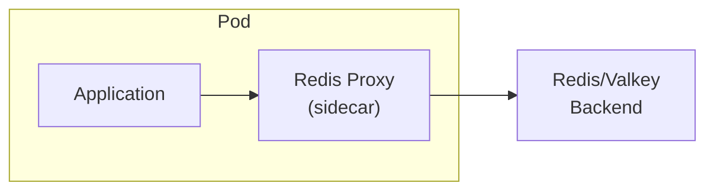
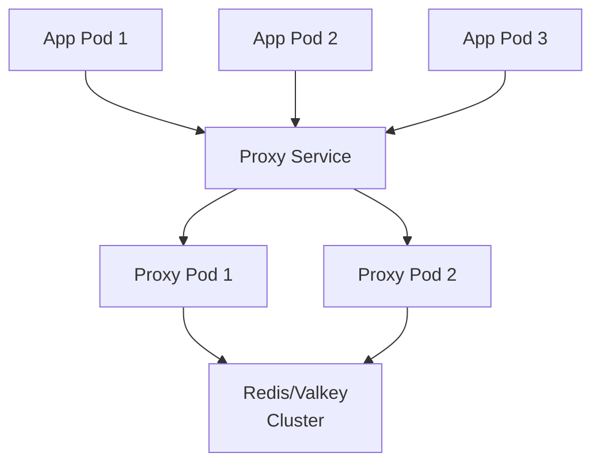

# Redis/Valkey Application-Layer Proxies

Survey of open-source Redis/Valkey proxies compatible with Kubernetes and managed service backends (ElastiCache Valkey, Azure Managed Redis).

---

## Table of Contents

1. [Requirements](#1-requirements)
2. [Recommended Proxies](#2-recommended-proxies)
   - [Envoy Proxy (Redis Filter)](#envoy-proxy-redis-filter)
   - [Predixy](#predixy)
   - [Twemproxy](#twemproxy)
3. [Not Recommended](#3-not-recommended)
4. [Managed Service Compatibility Matrix](#4-managed-service-compatibility-matrix)
5. [Kubernetes Deployment Patterns](#5-kubernetes-deployment-patterns)
6. [Recommendations by Use Case](#6-recommendations-by-use-case)
7. [Reference Links](#7-reference-links)

---

## 1. Requirements

All proxies must support:

- **ElastiCache Valkey** — cluster mode enabled and cluster mode disabled
- **Azure Managed Redis** — cluster mode enabled/disabled, Redis Enterprise sharding
- **Kubernetes deployment** — Helm charts, Deployments, StatefulSets, or sidecar patterns
- **Open source** license

### Critical: Cluster Mode Compatibility

AWS ElastiCache Cluster Mode nodes do **not** proxy requests to the correct shard — clients must either understand `CLUSTER SLOTS` topology or use a proxy that handles `MOVED`/`ASK` redirections. This is the key differentiator between proxy options.

---

## 2. Recommended Proxies

### Envoy Proxy (Redis Filter)

| Attribute | Value |
|---|---|
| Stars | 27,848 |
| Language | C++ |
| License | Apache-2.0 |
| Last push | 2026-04-19 (very active) |
| Governance | CNCF hosted project |

#### Features

- **Full Redis Cluster support** — periodic `CLUSTER SLOTS` discovery, `MOVED`/`ASK` redirection handling
- **Hash-based partitioning** — Ketama distribution for data spreading
- **Read replica routing** — configurable read request routing to replicas
- **Separate upstream/downstream AUTH** — transparent AUTH on server connection
- **AWS IAM authentication** — native ElastiCache/MemoryDB IAM auth support
- **Request mirroring** — all or write-only request mirroring
- **Prefix routing** — route by key prefix to different clusters
- **Detailed command statistics** — per-command stats and latency histograms
- **Health checking** — active and passive
- **Fault injection** — delay/error injection for testing
- **100+ commands supported** — strings, lists, sets, sorted sets, hashes, streams, geo, hyperloglog

#### Limitations

- Only RESP2 protocol supported (no RESP3)
- Transactions require all keys in the same hashslot
- Circuit breaking and built-in retry are planned but not yet available
- Heavier resource footprint than dedicated Redis proxies
- Steeper learning curve — Envoy is a general-purpose proxy, not Redis-specific

#### K8s Integration

Native CNCF integration. Widely deployed as sidecar in Istio/service mesh. Supports Ambient Mesh (sidecarless) pattern. Can be deployed as DaemonSet, sidecar, or standalone Deployment.

---

### Predixy

| Attribute | Value |
|---|---|
| Stars | 1,576 |
| Forks | 360 |
| Language | C++ |
| License | BSD-3-Clause |
| Latest release | v7.0.1 — December 11, 2023 |
| Last push | July 19, 2024 |

#### Features

- **Redis Sentinel support** — single/multi redis groups
- **Redis Cluster support** — full cluster topology awareness
- **Blocking commands** — `BLPOP`, `BRPOP`, `BRPOPLPUSH`
- **Multi-key commands** — `MSET`, `MSETNX`, `MGET`, `DEL`, `UNLINK`, `TOUCH`, `EXISTS`
- **SCAN command** — even across multi-instance deployments
- **Multi-database support** — `SELECT` command works
- **Transactions** — limited to Redis Sentinel single group
- **Lua scripting** — `SCRIPT LOAD`, `EVAL`, `EVALSHA`
- **Pub/Sub**
- **Multi-datacenter** — read from slaves
- **Extended AUTH** — readonly/readwrite/admin permission, keyspace limit
- **Multi-threaded**
- **Latency monitoring** and statistics

#### Limitations

- No official Kubernetes Helm chart (community chart available at `asjfoajs/redis-cluster-predixy`)
- Limited documentation for K8s deployment patterns
- Last release December 2023, last push July 2024 — activity slowing
- Smaller community than Twemproxy or Envoy

#### K8s Integration

Community Helm chart combining Predixy + Redis Cluster. Docker/Compose support. No official Kubernetes operator. Deploy as Deployment or StatefulSet.

---

### Twemproxy

| Attribute | Value |
|---|---|
| Stars | 12,347 |
| Forks | 2,044 |
| Language | C |
| License | Apache-2.0 |
| Latest release | v0.5.0 — July 13, 2021 |
| Last push | March 29, 2024 |
| Open issues | 193 |

#### Features

- **Connection pooling and multiplexing**
- **Consistent hashing** — Ketama (default), modula, random distribution
- **Server failure detection** — auto-ejection of failed nodes
- **Pipelining support**
- **Multiple backend pools**
- **YAML configuration**
- **Built-in statistics** — monitoring port for stats

#### Battle-tested Adoption

Twitter, Pinterest, Snapchat, Flickr, Yahoo, Tumblr, Twitch, Uber.

#### Limitations

- **Does NOT support Redis Cluster natively** — no `CLUSTER SLOTS` handling, no auto-discovery of cluster topology changes
- Cannot handle dynamic cluster topology — requires static shard configuration
- No TLS in older versions
- Minimal recent development (last release July 2021)
- Not suitable for ElastiCache cluster mode enabled without a separate cluster-aware layer

#### K8s Integration

Stateless proxy design suitable for sidecar or separate service. Community Docker images available. No official Helm chart or operator.

---

## 3. Not Recommended

| Project | Why | Last Release |
|---|---|---|
| [Redis Cluster Proxy](https://github.com/RedisLabs/redis-cluster-proxy) | Explicitly unmaintained. README: "not actively maintained... We discourage its usage in any production environment." AGPL-3.0. | Alpha (2023) |
| [Codis](https://github.com/CodisLabs/codis) | Unmaintained since 2018. Zookeeper/etcd dependency. 13.2k stars but no updates in 8 years. | v3.2.2 (Jan 2018) |
| [Aster](https://github.com/wayslog/aster) | Dormant. Rust-based with good benchmarks but no releases since 2019. | v0.1.4 (Mar 2019) |
| [RCProxy](https://github.com/clia/rcproxy) | Minimal maintenance. Fork of Aster. 74 stars. | v2.2.1 (Oct 2022) |
| [Overlord](https://github.com/bilibili/overlord) | Mesos-focused, not K8s. Last release 2020. | v1.9.4 (Mar 2020) |

---

## 4. Managed Service Compatibility Matrix

| Proxy | ElastiCache (non-cluster) | ElastiCache (cluster mode) | Valkey ElastiCache | Azure Managed Redis | Azure Redis Enterprise |
|---|---|---|---|---|---|
| **Envoy** | Yes | Yes (CLUSTER SLOTS) | Yes | Yes | Yes |
| **Predixy** | Yes (Sentinel mode) | Yes (Cluster mode) | Yes | Yes | Yes |
| **Twemproxy** | Yes | **No** (no cluster discovery) | Partial | Yes | Partial |

### Key Considerations

**ElastiCache Cluster Mode Enabled:**
- Requires proxy that handles `CLUSTER SLOTS` topology discovery
- Twemproxy cannot auto-discover cluster topology — it treats backends as static shards
- Envoy and Predixy both handle this natively

**Azure Managed Redis with Redis Enterprise Sharding:**
- Redis Enterprise uses a built-in proxy per node that handles routing
- External proxies connect to the single endpoint — the Enterprise proxy handles internal routing
- All three recommended proxies work with Azure Redis Enterprise's single endpoint

**Valkey Compatibility:**
- Valkey uses the same Redis protocol — all proxies that speak Redis protocol work with Valkey
- No Valkey-specific proxy features needed

---

## 5. Kubernetes Deployment Patterns

### Sidecar Pattern

Best for: Envoy (native sidecar support via Istio). Lower latency, higher per-pod resource cost.

### Centralized Proxy

Best for: Predixy, Twemproxy. Efficient for many application pods. Deploy as Deployment with HPA.

### DaemonSet Pattern

One proxy instance per node. Good for high-throughput workloads with many pods per node. Works with any proxy.

### Native Cluster (No Proxy)

Modern alternative: use cluster-aware clients (e.g., `go-redis/redis` with cluster mode) that handle topology natively. Eliminates proxy layer entirely. Best for greenfield deployments where all clients support cluster mode.

---

## 6. Recommendations by Use Case

### ElastiCache Cluster Mode Enabled + K8s

**Envoy Proxy** — full cluster discovery, IAM auth, CNCF support, production-mature. Accept the heavier footprint for the operational benefits.

### ElastiCache Cluster Mode Disabled + K8s

**Twemproxy** — battle-tested, minimal footprint, proven at massive scale. No cluster discovery needed for non-cluster backends.

Or **Predixy** — if you also need Sentinel support or multi-datacenter read routing.

### Azure Managed Redis (Enterprise)

**Envoy** or **Predixy** — Azure Redis Enterprise's built-in proxy handles internal routing, so any proxy works. Choose based on whether you already run Envoy in your mesh.

### Greenfield with Cluster-Aware Clients

**Consider no proxy at all.** Valkey/Redis cluster-aware clients (go-redis, jedis, redis-py) handle topology natively. Use the official [Valkey Helm chart](https://valkey.io/blog/valkey-helm-chart/) for K8s deployment. K8s operators available from [SAP](https://github.com/SAP/valkey-operator) and [Hyperspike](https://github.com/hyperspike/valkey-operator).

---

## 7. Reference Links

| Resource | URL |
|---|---|
| Envoy Redis proxy docs | https://www.envoyproxy.io/docs/envoy/latest/intro/arch_overview/other_protocols/redis |
| Envoy Redis filter config | https://www.envoyproxy.io/docs/envoy/latest/configuration/listeners/network_filters/redis_proxy_filter |
| Predixy GitHub | https://github.com/joyieldInc/predixy |
| Twemproxy GitHub | https://github.com/twitter/twemproxy |
| Redis Cluster Proxy (unmaintained) | https://github.com/RedisLabs/redis-cluster-proxy |
| Valkey Helm chart | https://valkey.io/blog/valkey-helm-chart/ |
| SAP Valkey Operator | https://github.com/SAP/valkey-operator |
| Hyperspike Valkey Operator | https://github.com/hyperspike/valkey-operator |
| AWS ElastiCache cluster mode docs | https://docs.aws.amazon.com/AmazonElastiCache/latest/dg/Replication.Redis-RedisCluster.html |
| Predixy Helm chart (community) | https://github.com/asjfoajs/redis-cluster-predixy |
