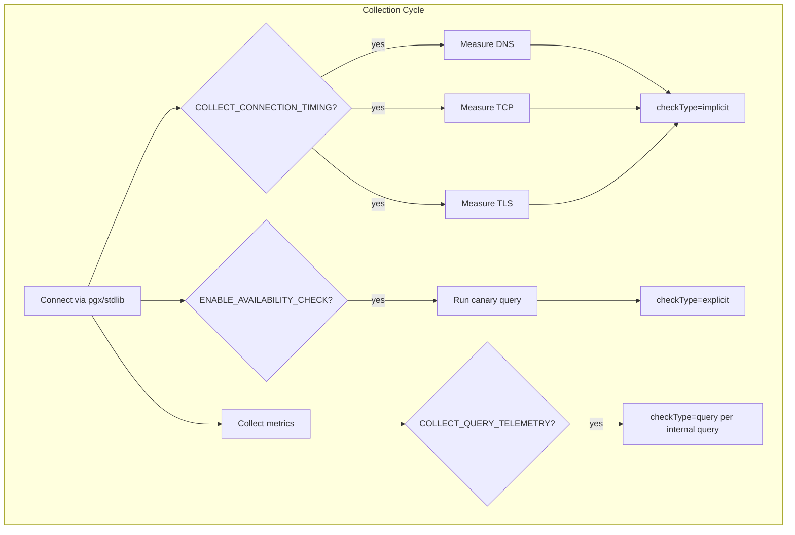

# nri-postgresql Driver Migration: lib/pq → pgx/v5

PR: [brybry192/nri-postgresql#1](https://github.com/brybry192/nri-postgresql/pull/1)

---

## Expanded Driver Migration Section

This section is written to preempt reviewer concerns about swapping a core dependency. It can be used directly in the PR description.

---

### Why Migrate?

**The old driver says so itself.** The [lib/pq README](https://github.com/lib/pq#status) states:

> "This package is currently in maintenance mode, which means: It generally does not accept new features. It does accept bug fixes and version compatibility changes provided by the community. Maintainers usually do not resolve reported issues. Community members are encouraged to help each other with reported issues."

> "For users that require new features or reliable resolution of reported bugs, we recommend using pgx which is under active development."

This notice was added in April 2020 (commit c782d9f). lib/pq's last release is v1.12.3 — bug fixes only.

**Technical necessity.** The observability features in this PR require capabilities that lib/pq does not and will never provide:

- **DialFunc:** lib/pq has no `DialFunc` hook. Connection timing (DNS, TCP, TLS phase measurement) requires injecting a custom dialer into the connection lifecycle. pgx exposes `pgconn.Config.DialFunc` for exactly this purpose.
- **Config model:** lib/pq uses Go's global `database/sql` driver registry via `init()`. There is no way to attach per-connection configuration (TLS callbacks, timing hooks) without a global singleton. pgx's `pgx.ConnConfig` holds configuration per connection, eliminating this limitation.
- **Race condition fix:** The existing code used `stdlib.RegisterConnConfig` / `stdlib.UnregisterConnConfig`, where `defer UnregisterConnConfig` fired when `NewConnection` returned — but `sqlx.DB` is lazy, so the driver tried to read the registry on the first query, after the entry was already removed. This manifested as `cannot parse 'registeredConnConfig0': failed to parse as keyword/value`. The fix: `stdlib.OpenDB(*config)` holds the config reference internally, no registry needed.

**Compatibility.** The `pgx/v5/stdlib` adapter preserves the `database/sql` interface. The migration is:

- `_ "github.com/lib/pq"` → `"github.com/jackc/pgx/v5/stdlib"`
- Connection opens via `stdlib.OpenDB(connConfig)` instead of `sqlx.Open("postgres", connStr)`
- All callers still receive `*sqlx.DB` — no API surface change upstream
- The `sqlx` layer (struct scanning, named queries) continues to work identically

**Risk mitigation:**

- **Same interface:** Callers interact with `*sqlx.DB` / `*sql.DB` — the driver swap is invisible above the connection layer
- **Integration tests pass:** The existing Docker-based integration test suite (PostgreSQL 9.6 and 17.9) passes without modification
- **New test coverage:** 97%+ coverage on all new observability code, including timing, error classification, and credential sanitization
- **Opt-in features:** All new flags default to `false`. With no flags set, the integration produces identical output to the previous version
- **E2E chaos tests:** 6 failure scenarios validated end-to-end with NerdGraph verification (container stop, network disconnect, pause, password change, query cancel, backend terminate)

---

## PR Architecture Summary

The PR adds three tiers of observability, all opt-in:

### Key Design Decisions

| Decision | Rationale |
|---|---|
| pgx/v5/stdlib over pgx native | Preserves sqlx/database/sql compatibility; minimizes migration risk |
| DialFunc timing on first query, not extra Ping | Zero additional round-trips; timing captured opportunistically |
| TLS via `tls.Config.VerifyConnection` callback | Measures from TCP completion to TLS finish without modifying handshake |
| Credential sanitization before publish | Redacts PostgreSQL URL passwords from error messages |
| Health samples on connection failure | `available=0` emitted even when `BuildCollectionList` fails, preventing gaps in time series |

---

## Source References

| Resource | URL |
|---|---|
| PR | https://github.com/brybry192/nri-postgresql/pull/1 |
| lib/pq README (maintenance notice) | https://github.com/lib/pq#status |
| pgx GitHub | https://github.com/jackc/pgx |
| pgx/v5/stdlib docs | https://pkg.go.dev/github.com/jackc/pgx/v5/stdlib |
