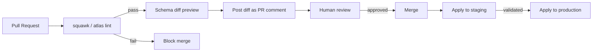
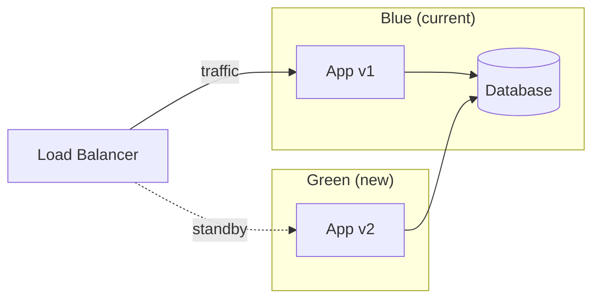
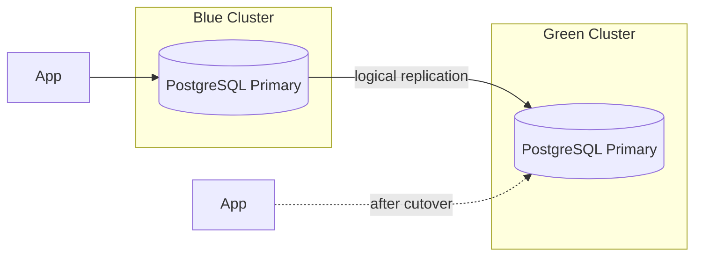
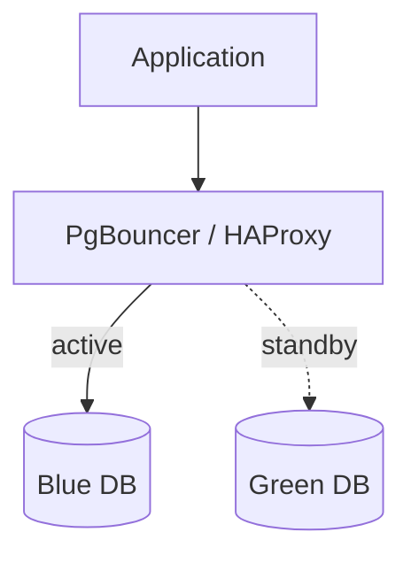
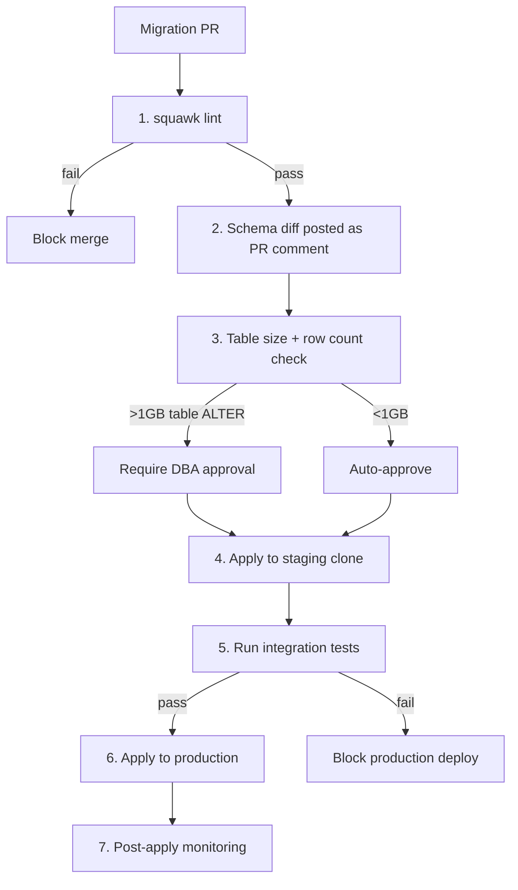

# Enterprise Schema Management — Study Guide

Language-agnostic, SQL-based schema management for multi-language organizations. Focus on safety, risk preview, automated protections, and zero-downtime deployment strategies.

---

## Table of Contents

1. [Tool Comparison](#1-tool-comparison)
2. [Safety and Risk Mitigation](#2-safety-and-risk-mitigation)
3. [Rollback Strategies](#3-rollback-strategies)
4. [Blue/Green Database Deployments](#4-bluegreen-database-deployments)
5. [Zero-Downtime Schema Change Patterns](#5-zero-downtime-schema-change-patterns)
6. [Enterprise Recommendation](#6-enterprise-recommendation)

---

## 1. Tool Comparison

### At a Glance

| Tool | Approach | Language | Rollback | Linting | License |
|---|---|---|---|---|---|
| **Flyway** | Versioned SQL | Java (CLI/Docker) | Undo (paid only) | No | Apache 2.0 / Commercial |
| **Liquibase** | Changelog (XML/YAML/SQL) | Java (CLI/Docker) | Auto + manual | No (Pro: policy checks) | Apache 2.0 / Commercial |
| **Atlas** | Declarative + versioned | Go (CLI/Docker) | Via plan reversal | Yes (built-in) | Apache 2.0 / Commercial |
| **dbmate** | Versioned SQL (up/down) | Go (single binary) | Down migrations | No | MIT |
| **golang-migrate** | Versioned SQL (up/down) | Go (library + CLI) | Down migrations | No | MIT |
| **Sqitch** | Change-based (deps) | Perl (CLI) | Revert scripts + verify | No | MIT |

### Flyway

**Version:** 10.x | **License:** Community (Apache 2.0), Teams, Enterprise

How it works: numbered SQL files (`V1__create_users.sql`, `V2__add_email.sql`) applied in order. Flyway tracks state in a `flyway_schema_history` table.

| Strength | Weakness |
|---|---|
| Widest enterprise adoption | **No rollback in community edition** |
| Simple mental model (numbered SQL files) | Undo migrations are a paid feature |
| Java callbacks for pre/post hooks | No built-in linting or diff |
| Maven/Gradle/CLI/Docker/K8s operator | Java dependency (even CLI needs JRE) |
| Baseline for existing databases | No declarative schema support |
| Repair for corrupted state table | Repeatable migrations (R__) can be surprising |

**Rollback gap:** In community Flyway, if a migration breaks production, your only option is a forward-fix. The `undo` feature (V1__name.sql → U1__name.sql) requires Teams edition ($$.

### Liquibase

**Version:** 4.x | **License:** Community (Apache 2.0), Pro, Enterprise

Changelog-based. Supports XML, YAML, JSON, and raw SQL changelog formats. Tracks state in `databasechangelog` + `databasechangeloglock` tables.

| Strength | Weakness |
|---|---|
| **Auto-rollback for many change types** | Complex XML/YAML format (SQL format is simpler) |
| Diff/snapshot for schema comparison | Steep learning curve |
| Contexts and labels for env targeting | Overhead for simple projects |
| Preconditions (skip migrations conditionally) | Java dependency |
| Pro: policy checks, secrets management | Lock table can get stuck |
| `rollback-count`, `rollback-to-date` commands | Auto-rollback doesn't cover all DDL |

**Rollback support:** For many built-in change types (createTable, addColumn, etc.), Liquibase can auto-generate rollback SQL. For raw SQL changesets, you must provide explicit rollback blocks. Pro adds `rollback-on-error` for automatic revert on failure.

### Atlas

**Version:** Active development (2024-2026) | **License:** Apache 2.0 (CLI), Commercial (Cloud)

The most modern tool. Two modes:

- **Declarative:** Define desired schema state (HCL or SQL), Atlas computes the diff and generates a migration plan
- **Versioned:** Traditional numbered migrations, but with schema diffing and linting

| Strength | Weakness |
|---|---|
| **Built-in migration linting** (`atlas lint`) | Newer, smaller community than Flyway/Liquibase |
| Declarative schema diffing | HCL format is another DSL to learn (SQL format available) |
| Plan preview before apply | Cloud features require commercial license |
| CI/CD integration (GitHub Action) | Less battle-tested at extreme scale |
| Policy enforcement | |
| Go binary, no JRE needed | |
| Terraform provider | |

**Linting:** `atlas lint` detects destructive changes (drop table, drop column), backwards-incompatible modifications, data-dependent changes, and naming convention violations. This runs in CI before merge.

### dbmate

**Version:** Latest stable | **License:** MIT

Philosophy: simple, no dependencies. Single Go binary. Migrations are plain SQL with `-- migrate:up` / `-- migrate:down` markers.

| Strength | Weakness |
|---|---|
| Zero dependencies (single binary) | No linting, no dry-run, no diff |
| Docker-friendly (tiny image) | No auto-rollback on failure |
| Plain SQL migrations | No enterprise features |
| Fast, predictable | No environment targeting |
| Good for microservices | No schema comparison |

Good for small teams and microservices. Insufficient for enterprise-scale safety requirements.

### golang-migrate

**Version:** v4.x | **License:** MIT

Go library + CLI. Migrations are up/down SQL files. Used as a library within Go applications or standalone.

Similar to dbmate but designed as an embeddable library. Supports many database drivers. No safety features, no linting, no dry-run.

### Sqitch

**Version:** 1.x | **License:** MIT

Change-based (not version-based). Each change has deploy, revert, and verify scripts. Changes declare dependencies on other changes, forming a DAG.

| Strength | Weakness |
|---|---|
| Dependency-aware ordering | Perl dependency |
| Verify scripts confirm changes applied correctly | Steep learning curve |
| Revert scripts are first-class | Smaller community |
| No numbering conflicts in parallel development | Not widely adopted in enterprise |

The verify script concept is underappreciated: after applying a migration, Sqitch runs a verification query to confirm the expected state exists.

---

## 2. Safety and Risk Mitigation

This is the most critical section. The default behavior of every migration tool is: apply SQL to production, hope it works. That is not acceptable at scale.

### Pre-Deployment Safety

#### Migration Linting

Detect dangerous operations before they reach production.

**squawk** ([github.com/sbdchd/squawk](https://github.com/sbdchd/squawk)) — PostgreSQL-specific migration linter:

```
$ squawk migration.sql
migration.sql:1:1: warning: adding-not-nullable-field
   Adding a NOT NULL column without a DEFAULT will lock the table and fail
   if any rows exist. Add a DEFAULT value or make the column nullable first.

migration.sql:5:1: warning: ban-drop-column
   Dropping a column may break running application code. Use expand-and-contract.
```

squawk catches:
- `NOT NULL` without `DEFAULT` on existing tables
- `DROP COLUMN` / `DROP TABLE` without safeguards
- Non-concurrent index creation on large tables
- `ALTER TYPE` on enums (PG acquires `ACCESS EXCLUSIVE` lock)
- Setting columns to `NOT NULL` without a check constraint first
- Renaming columns/tables (breaks running code)

**Atlas lint** — built-in to Atlas, catches destructive changes and backwards-incompatible modifications.

**skeema** — MySQL-focused schema diffing and linting.

#### CI Pipeline Integration



Recommended CI gates:
1. **squawk lint** — block on any warning (run on every PR that touches migration files)
2. **Schema diff preview** — post the planned changes as a PR comment (Atlas or Liquibase diff)
3. **Table size check** — for ALTER operations, query `pg_total_relation_size()` in staging and add the estimated impact to the PR comment
4. **Required approval** — migrations touching tables >1GB require explicit DBA approval
5. **Dry-run in staging** — apply to a staging clone before production

#### Estimated Impact Analysis

Before applying an ALTER to production, automatically assess:

```sql
-- Table size (estimate lock duration)
SELECT pg_size_pretty(pg_total_relation_size('my_table'));

-- Row count (estimate rewrite time for ALTER TYPE)
SELECT reltuples::bigint FROM pg_class WHERE relname = 'my_table';

-- Active connections (estimate disruption)
SELECT count(*) FROM pg_stat_activity WHERE datname = current_database();
```

Build a pre-apply hook that:
1. Parses the migration SQL for ALTER/DROP statements
2. Queries the target table sizes
3. Estimates lock duration based on table size
4. Blocks if estimated lock time exceeds threshold (e.g., 30 seconds)
5. Recommends online DDL alternatives (e.g., `CREATE INDEX CONCURRENTLY`)

### Runtime Safety

#### Statement and Lock Timeouts

Always set before DDL in production:

```sql
-- Prevent a single DDL from holding a lock forever
SET lock_timeout = '5s';

-- Prevent a runaway migration from blocking queries indefinitely
SET statement_timeout = '30s';
```

If the lock cannot be acquired within 5 seconds, the DDL fails instead of blocking all reads/writes. This is the single most important safety measure for production migrations.

#### Advisory Locks

Prevent concurrent migration runs:

```sql
-- Acquire an advisory lock (or fail immediately)
SELECT pg_try_advisory_lock(12345);
-- ... run migrations ...
SELECT pg_advisory_unlock(12345);
```

Flyway, Liquibase, and Atlas all use advisory locks or lock tables. If you use dbmate or golang-migrate, implement this yourself.

#### Transaction Wrapping

PostgreSQL DDL is transactional. Leverage this:

```sql
BEGIN;
SET lock_timeout = '5s';
ALTER TABLE users ADD COLUMN email TEXT;
ALTER TABLE users ADD COLUMN phone TEXT;
COMMIT;
-- If either ALTER fails, both are rolled back atomically
```

**What works in a transaction:** CREATE TABLE, ALTER TABLE (add/drop column, rename), CREATE/DROP INDEX (not CONCURRENTLY), CREATE/ALTER/DROP VIEW, CREATE/ALTER/DROP FUNCTION.

**What does NOT work in a transaction:** `CREATE INDEX CONCURRENTLY`, `ALTER TYPE ... ADD VALUE` (enum additions), `VACUUM`, `CLUSTER`.

#### Connection Draining

Before heavy DDL, drain connections:

1. Set the application to "read-only" mode (or route traffic to replica)
2. Wait for active transactions to complete (`pg_stat_activity`)
3. Apply the migration
4. Restore normal traffic

---

## 3. Rollback Strategies

### PostgreSQL: Transactional DDL

PostgreSQL's greatest schema management advantage: most DDL is transactional. Wrap migrations in a transaction and they roll back atomically on failure.

```sql
BEGIN;
CREATE TABLE orders (id SERIAL PRIMARY KEY, amount NUMERIC);
ALTER TABLE users ADD COLUMN order_count INT DEFAULT 0;
-- If this fails:
ALTER TABLE users ADD CONSTRAINT invalid_check CHECK (age > 0);
-- Everything above is rolled back. The table and column are not created.
ROLLBACK; -- or automatic on error
```

### MySQL: No Transactional DDL

MySQL (InnoDB) commits DDL implicitly. Every `ALTER TABLE` is permanent the moment it executes. There is no atomic rollback of DDL.

**Implications:**
- Every migration must have an explicit down/revert script
- Partial failures leave the schema in an inconsistent state
- You must test migrations against a staging copy first
- Consider `pt-online-schema-change` or `gh-ost` for large table ALTERs

### Down Migrations vs Forward-Fix

| Approach | Pros | Cons |
|---|---|---|
| **Down migrations** | Mechanical rollback, easy to automate | Down migration may be wrong/untested; data loss risk |
| **Forward-fix** | Fix moves forward (no reversal ambiguity) | Slower recovery; requires a new migration under pressure |

**Recommendation:** Write down migrations for all schema changes (they're cheap insurance), but prefer forward-fix for production incidents. Down migrations are most valuable in staging/development, not as a production recovery mechanism.

### State Table Corruption Recovery

If the migration state table (`flyway_schema_history`, `databasechangelog`, `schema_migrations`) gets corrupted:

- **Flyway:** `flyway repair` — removes failed entries, realigns checksums
- **Liquibase:** `liquibase clearCheckSums` — recalculates, or manually update `databasechangelog`
- **Atlas:** `atlas schema inspect` — reconstructs state from actual schema
- **dbmate/golang-migrate:** manually update `schema_migrations` table

---

## 4. Blue/Green Database Deployments

### Pattern 1: Application-Level Blue/Green (Same Database)



Both app versions point to the same database. The migration must be **backward compatible** — old code must work with the new schema.

**Expand-and-contract** is mandatory here (see section 5).

**Pros:** Simple, no database duplication. **Cons:** Schema must be compatible with both app versions simultaneously.

### Pattern 2: Database-Level Blue/Green with Logical Replication



**How it works:**
1. Blue cluster serves production traffic
2. Green cluster is a replica receiving changes via logical replication
3. Apply migration to Green while Blue serves traffic
4. Validate Green (run tests, check schema, verify data)
5. Cutover: redirect traffic to Green
6. Green becomes the new primary

**PostgreSQL Logical Replication Constraints:**

| Constraint | Impact |
|---|---|
| DDL is NOT replicated | Schema changes on Green don't propagate to Blue (this is a feature here) |
| Only replicates DML (INSERT/UPDATE/DELETE) | Must apply structural changes manually to Green |
| Sequences are not replicated | Must sync sequences before cutover |
| Large objects not replicated | Must handle separately |
| Initial snapshot required | First sync can be slow for large databases |
| Replication slots consume WAL | Monitor `pg_replication_slots` to prevent WAL bloat |

**The key insight:** Logical replication's limitation (DDL not replicated) is actually the feature you want — it lets you change the schema on Green independently while Blue's schema remains stable.

**Cutover process:**
1. Verify replication lag is zero (`pg_stat_replication`)
2. Stop writes to Blue (set to read-only or pause application)
3. Wait for final replication catchup
4. Sync sequences: `SELECT setval('seq_name', (SELECT last_value FROM seq_name@blue))`
5. Redirect application to Green
6. Verify Green is serving correctly
7. Drop replication slot on Blue

### Pattern 3: Proxy-Based Routing



PgBouncer, HAProxy, or a custom proxy routes traffic between Blue and Green.

**Cutover:**
1. Drain connections on Blue (PgBouncer `PAUSE`)
2. Switch routing to Green
3. Resume connections (`RESUME`)
4. Total downtime: seconds (connection drain time)

**PgBouncer specifics:** Use `PAUSE <db>` to pause a specific database, `RESUME <db>` to resume. Connections are held (not dropped) during pause, so clients see a brief stall, not a disconnect.

### Pattern 4: AWS Aurora / RDS Blue/Green

Amazon's managed blue/green deployment for Aurora and RDS.

**How it works:**
- Creates a staging environment (Green) from a snapshot of production (Blue)
- Uses binlog replication (Aurora MySQL) or logical replication (Aurora PostgreSQL) to keep Green in sync
- Apply schema changes to Green
- Run validation queries on Green
- Switchover: Amazon swaps endpoints, so the application connection string stays the same

**Limitations:**
- Aurora PostgreSQL B/G: logical replication, so same PG logical replication constraints apply
- Switchover causes a brief outage (~30 seconds for connection drain)
- The Green environment cannot use a different engine version (same major version required)
- Some DDL on Green can break replication (altering replicated columns)
- The old Blue is retained as a fallback (you choose when to delete)

**Best for:** Organizations already on Aurora that want managed blue/green without building the infrastructure themselves.

---

## 5. Zero-Downtime Schema Change Patterns

The **expand-and-contract** pattern is the foundation of all safe schema changes:

1. **Expand:** Make an additive, backward-compatible change
2. **Migrate:** Update application code to use the new schema
3. **Contract:** Remove the old schema element (once all code is on the new version)

### Common Operations

#### Adding a Column

```sql
-- Safe: always nullable or with DEFAULT
ALTER TABLE users ADD COLUMN email TEXT;
-- or (PG 11+ adds DEFAULT without rewriting table)
ALTER TABLE users ADD COLUMN email TEXT NOT NULL DEFAULT '';
```

**Never** add `NOT NULL` without `DEFAULT` on a table with rows — it rewrites the entire table under an exclusive lock.

#### Removing a Column

```sql
-- Step 1: Stop reading the column in application code (deploy)
-- Step 2: Stop writing the column (deploy)
-- Step 3: Drop
ALTER TABLE users DROP COLUMN legacy_field;
```

**Never** drop a column while any running code references it.

#### Renaming a Column

```sql
-- Step 1: Add new column
ALTER TABLE users ADD COLUMN full_name TEXT;
-- Step 2: Backfill (batched, off-peak)
UPDATE users SET full_name = name WHERE full_name IS NULL; -- in batches
-- Step 3: Deploy code to read/write new column
-- Step 4: Drop old column
ALTER TABLE users DROP COLUMN name;
```

**Never** use `ALTER TABLE RENAME COLUMN` in production — it breaks all running code instantly.

#### Adding an Index

```sql
-- Safe: CONCURRENTLY does not lock writes
CREATE INDEX CONCURRENTLY idx_users_email ON users (email);
```

**Never** use `CREATE INDEX` (without CONCURRENTLY) on a large table — it acquires a write lock for the entire build duration.

**Note:** `CREATE INDEX CONCURRENTLY` cannot run inside a transaction. Migration tools must handle this (Flyway, Liquibase, and Atlas all support non-transactional migrations).

#### Changing a Column Type

```sql
-- Step 1: Add new column with desired type
ALTER TABLE orders ADD COLUMN amount_numeric NUMERIC(12,2);
-- Step 2: Backfill (batched)
UPDATE orders SET amount_numeric = amount::NUMERIC(12,2) WHERE amount_numeric IS NULL;
-- Step 3: Deploy code to read/write new column
-- Step 4: Drop old column
ALTER TABLE orders DROP COLUMN amount;
-- Step 5 (optional): Rename
ALTER TABLE orders RENAME COLUMN amount_numeric TO amount;
```

**Never** use `ALTER TABLE ALTER COLUMN TYPE` on a large table — it rewrites every row under an exclusive lock.

#### Enum Modifications (PostgreSQL)

```sql
-- Adding a value: safe (PG 10+, but cannot run in a transaction)
ALTER TYPE status_enum ADD VALUE 'archived';

-- Removing/renaming a value: not supported by ALTER TYPE
-- Use the swap pattern:
-- 1. Create new type
CREATE TYPE status_enum_v2 AS ENUM ('active', 'inactive', 'archived');
-- 2. Alter column to use new type
ALTER TABLE orders ALTER COLUMN status TYPE status_enum_v2 USING status::TEXT::status_enum_v2;
-- 3. Drop old type
DROP TYPE status_enum;
-- 4. Rename
ALTER TYPE status_enum_v2 RENAME TO status_enum;
```

**Note:** `ALTER TYPE ADD VALUE` cannot run in a transaction. It must be a standalone migration.

---

## 6. Enterprise Recommendation

### Tool Selection

For a large, multi-language organization:

**Primary tool: Atlas** — the most safety-focused tool available today:
- Built-in linting catches destructive changes before they reach staging
- Declarative mode computes diffs automatically, reducing human error
- Versioned mode available for teams that prefer traditional migrations
- Go binary, no JRE — lightweight in CI/CD and Docker
- Terraform provider for infrastructure-as-code integration
- Active development with cloud CI integration

**Runner-up: Flyway** — if your organization is already standardized on Flyway, the cost of switching may not justify the safety gains. Instead, layer squawk + CI gates on top of Flyway.

**For safety-critical environments: Liquibase** — its auto-rollback and rollback-on-error (Pro) are the strongest rollback story of any tool.

### Mandatory CI/CD Safety Layers

Regardless of tool choice, implement these gates:



1. **squawk lint** on every migration file (blocks merge on warnings)
2. **Schema diff preview** posted as PR comment (Atlas diff or Liquibase diff)
3. **Table size check** — query `pg_total_relation_size()` for affected tables
4. **Staging apply** — always apply to a staging clone first
5. **Integration test run** — verify application works with new schema
6. **Lock/statement timeouts** — every production migration sets `SET lock_timeout = '5s'; SET statement_timeout = '30s';`
7. **Post-apply monitoring** — check error rates, latency, connection counts for 15 minutes after migration

### Deployment Pattern by Risk Level

| Risk | Example | Strategy |
|---|---|---|
| **Low** | Add nullable column, add index concurrently | Apply directly with lock_timeout |
| **Medium** | Add NOT NULL with DEFAULT, backfill data | Apply in maintenance window, staging-validated |
| **High** | ALTER column type on large table, drop table | Blue/green deployment with logical replication |
| **Critical** | Restructure core table (>100GB) | Blue/green + canary (apply to read replica first, validate, then primary) |

### Automated Protection Hooks

Build these as pre-apply hooks in your migration pipeline:

```python
# Pseudocode for a pre-apply safety hook
def pre_apply_check(migration_sql, target_db):
    parsed = parse_sql(migration_sql)

    for statement in parsed:
        if statement.is_alter or statement.is_drop:
            table = statement.target_table
            size = query(target_db, f"SELECT pg_total_relation_size('{table}')")
            rows = query(target_db, f"SELECT reltuples FROM pg_class WHERE relname = '{table}'")

            if size > 1_GB:
                require_approval("DBA", f"{table} is {size} — manual approval required")

            if statement.is_alter_type and rows > 1_000_000:
                block(f"ALTER TYPE on {rows} rows will rewrite table — use expand-and-contract")

            if statement.creates_index and "CONCURRENTLY" not in statement.text:
                block(f"CREATE INDEX without CONCURRENTLY on {table} ({size})")

    # Always set safety timeouts
    prepend(migration_sql, "SET lock_timeout = '5s'; SET statement_timeout = '30s';")
```

### MySQL-Specific Considerations

MySQL lacks transactional DDL, so extra precautions are needed:

- **Use `pt-online-schema-change` or `gh-ost`** for any ALTER on tables >1M rows
- **Always test down migrations** — there is no atomic rollback
- **Consider ProxySQL** for blue/green routing (MySQL equivalent of PgBouncer)
- **InnoDB row format changes** require table rebuild — schedule during low traffic
- **Foreign key constraints** complicate online schema changes — gh-ost handles this better than pt-osc

---

## Sources

| Source | URL |
|---|---|
| Flyway docs | https://documentation.red-gate.com/fd |
| Liquibase docs | https://docs.liquibase.com |
| Atlas docs | https://atlasgo.io/docs |
| dbmate | https://github.com/amacneil/dbmate |
| golang-migrate | https://github.com/golang-migrate/migrate |
| Sqitch | https://sqitch.org |
| squawk (PG linter) | https://github.com/sbdchd/squawk |
| PostgreSQL DDL transaction support | https://wiki.postgresql.org/wiki/Transactional_DDL_in_PostgreSQL |
| PostgreSQL logical replication | https://www.postgresql.org/docs/current/logical-replication.html |
| AWS Aurora blue/green | https://docs.aws.amazon.com/AmazonRDS/latest/AuroraUserGuide/blue-green-deployments.html |
| gh-ost | https://github.com/github/gh-ost |
| pt-online-schema-change | https://docs.percona.com/percona-toolkit/pt-online-schema-change.html |
