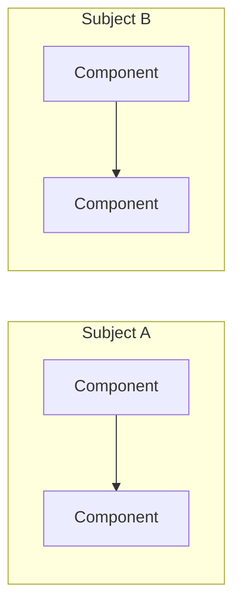

# \<Subject A\> vs \<Subject B\> [\vs \<Subject C\>]

*One-sentence summary of what is being compared and why.*

---

## At a Glance

| Dimension | Subject A | Subject B |
|---|---|---|
| Language / version | | |
| License | | |
| Primary use case | | |
| Maturity | | |

---

## Architecture Comparison

---

## Where They Align

*Shared patterns, conventions, or design decisions.*

---

## Where They Diverge

*Key differences — focus on differences that affect decisions, not cosmetic ones.*

| Area | Subject A | Subject B | Impact |
|---|---|---|---|
| | | | |

---

## Recommendations

*Given the comparison, what should be done? Standardize? Adopt one over the other? Use both for different cases?*

---

## Sources

| Source | URL |
|---|---|
| | |
