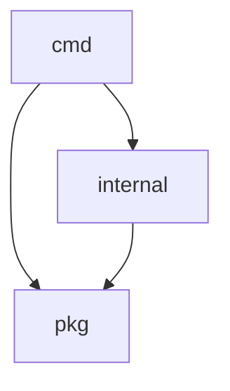

# \<Repo Name\> — Go Repository Analysis

**Repository:** \<URL\>
**License:** \<license\>
**Go version:** \<version\>
**Module path:** \<module\>

---

## Table of Contents

1. [Purpose and Scope](#1-purpose-and-scope)
2. [Module Structure](#2-module-structure)
3. [Key Dependencies](#3-key-dependencies)
4. [Build System](#4-build-system)
5. [Code Patterns](#5-code-patterns)
6. [Testing Strategy](#6-testing-strategy)
7. [Observability](#7-observability)
8. [Concerns and Improvement Areas](#8-concerns-and-improvement-areas)
9. [Reference Links](#9-reference-links)

---

## 1. Purpose and Scope

*What does this repo do? What problem does it solve? Where does it fit in the larger system?*

---

## 2. Module Structure

```
repo-name/
├── cmd/              ← entry points
├── pkg/              ← public packages
├── internal/         ← private packages
├── go.mod
└── Makefile
```

### Package Dependency Graph



---

## 3. Key Dependencies

| Dependency | Version | Role |
|---|---|---|
| | | |

---

## 4. Build System

| Target | Command | Description |
|---|---|---|
| Build | `make compile` | |
| Test | `make test` | |
| Lint | `make lint` | |
| Integration | `make test-integration` | |

### CI/CD

*What runs in CI? What's enforced (lint, race, coverage thresholds)?*

---

## 5. Code Patterns

### Error Handling

*Wrapping strategy, sentinel errors, error classification (transient vs permanent).*

### Concurrency

*Goroutine usage, synchronization primitives, context propagation.*

### Interfaces

*Key interfaces, how they enable testing and extensibility.*

### Configuration

*How config is loaded — flags, env vars, files. Validation approach.*

---

## 6. Testing Strategy

### Unit Tests

*Coverage, patterns, mocking approach.*

### Integration Tests

*Docker Compose setup, real dependencies, test data management.*

### Coverage

| Package | Coverage |
|---|---|
| | |

---

## 7. Observability

*Logging (structured? levels?), metrics (Prometheus? StatsD?), tracing.*

---

## 8. Concerns and Improvement Areas

> **Concern:** *Describe the issue, its impact, and a suggested fix.*

---

## 9. Reference Links

| Resource | URL |
|---|---|
| GitHub repo | |
| pkg.go.dev | |
| Official docs | |
