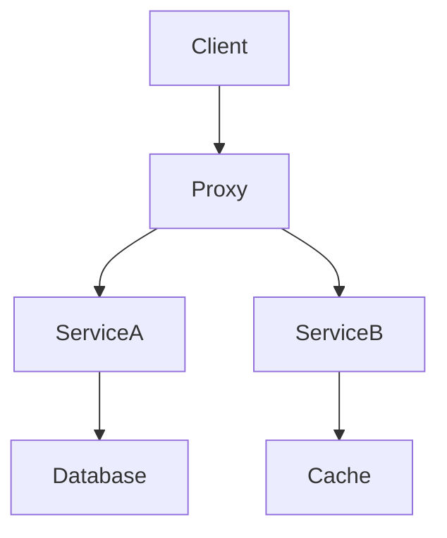
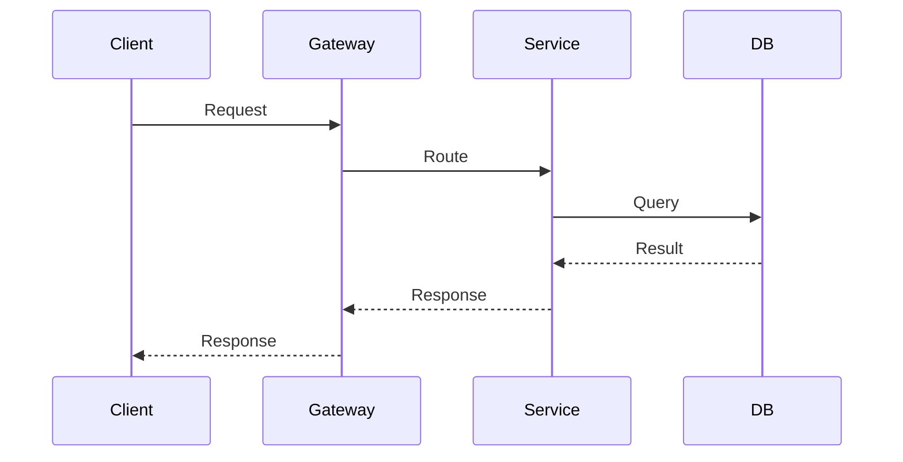

# \<System Name\> — Architecture Analysis

*One-sentence summary of what this system does.*

---

## Table of Contents

1. [System Overview](#1-system-overview)
2. [Component Architecture](#2-component-architecture)
3. [Data Flow](#3-data-flow)
4. [Deployment and Configuration](#4-deployment-and-configuration)
5. [Failure Modes and Resilience](#5-failure-modes-and-resilience)
6. [Observability](#6-observability)
7. [Security Considerations](#7-security-considerations)
8. [Concerns and Improvement Areas](#8-concerns-and-improvement-areas)
9. [Reference Links](#9-reference-links)

---

## 1. System Overview

*What problem does this system solve? Who are its consumers? What are its boundaries?*

---

## 2. Component Architecture

### Component Responsibilities

| Component | Responsibility | Repo / Package |
|---|---|---|
| | | |

---

## 3. Data Flow

### Request Path

### Control Plane (if applicable)

*How is configuration distributed? Leader election? CRD reconciliation?*

---

## 4. Deployment and Configuration

### Kubernetes Resources

| Resource | Purpose |
|---|---|
| Deployment | |
| Service | |
| ConfigMap | |
| CRD | |

### Configuration Surface

*Flags, env vars, config files, CRD spec fields. What's hot-reloadable vs requires restart?*

---

## 5. Failure Modes and Resilience

| Failure | Impact | Mitigation |
|---|---|---|
| | | |

*Circuit breakers, retries, backoff, graceful degradation.*

---

## 6. Observability

### Metrics

| Metric | Type | Description |
|---|---|---|
| | | |

### Logging

*Structured? What fields? Log levels and when they fire.*

### Tracing

*Span propagation, instrumented boundaries.*

---

## 7. Security Considerations

*AuthN/AuthZ, TLS, secrets management, network policies, RBAC.*

---

## 8. Concerns and Improvement Areas

> **Concern:** *Describe the issue, its impact, and a suggested fix.*

---

## 9. Reference Links

| Resource | URL |
|---|---|
| | |
